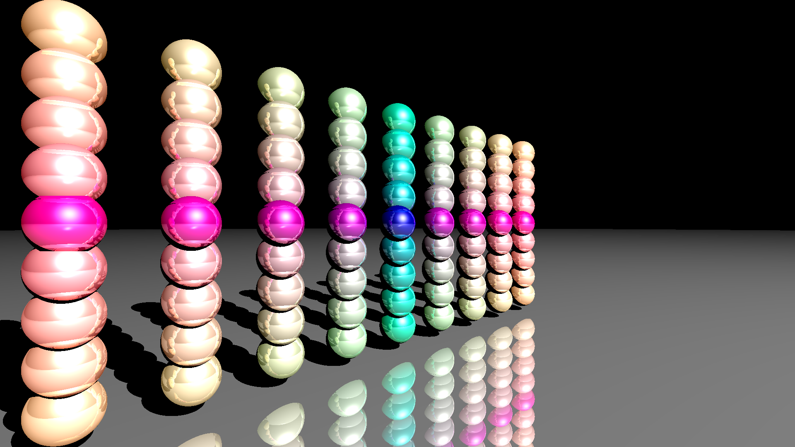
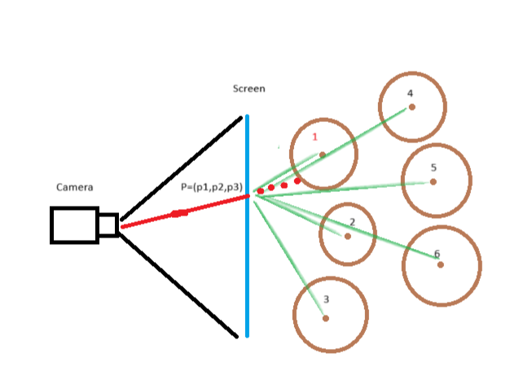
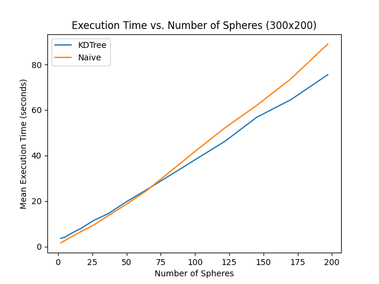
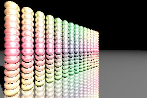
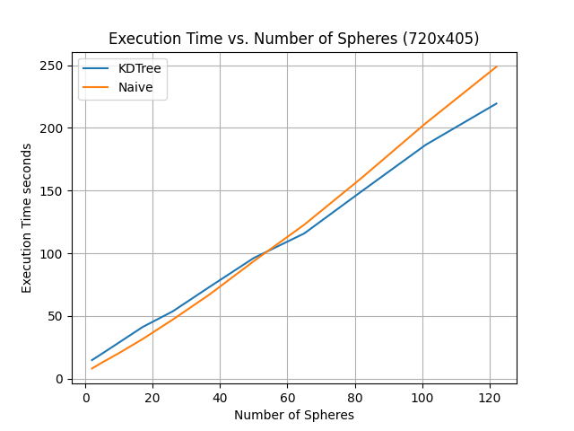
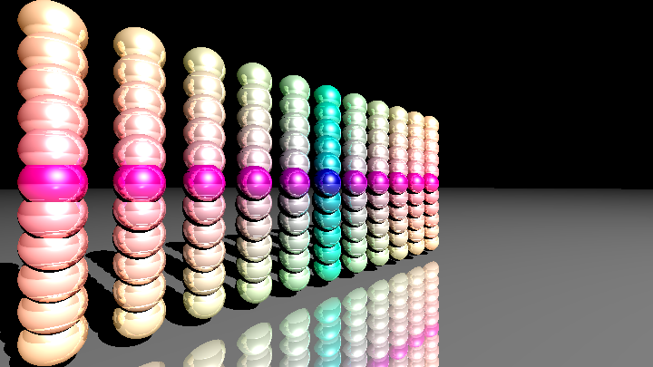
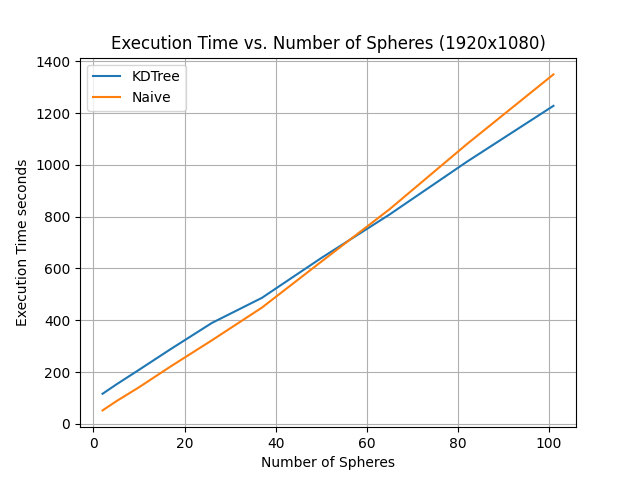
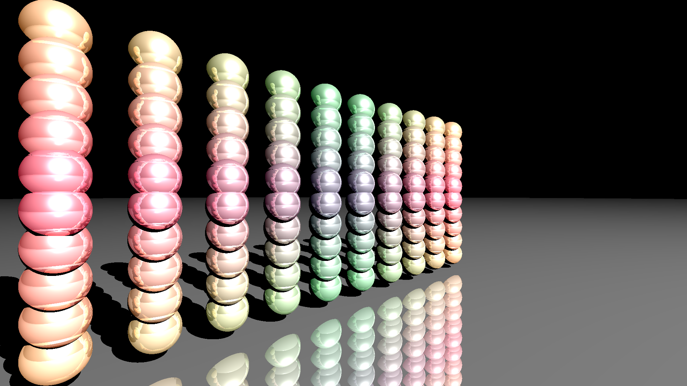

# KD-Tree and naive raytracing, a comparision

### Author
Harald Shiva Olin 2024,   
This project was done as a part of the course:    
DD2470 HT24 Advanced Topics in Visualization and Computer Graphics  
at  
KTH Royal Institute of Technology

## About this program
This is a program that benchmarks a naive raytracer against my own algorithm that uses a KD-tree for intersection look-up. 

## KD-tree lookup Algorithm

What my algorithm does for a point **P** on the screen: 
- Query a KD-tree with sphere centers as nodes
- Get nearest neighbours to **P**
- Check if the red ray from the camera intersects any sphere starting with the nearest.
- Assumes first hit is the nearest 

## Results 

For the resolution 300x200 pixels, we see a improvement in the mean time to render the image at about 75 spheres in the scene. At this resolution we could render up to 200 spheres without it taking to much time.

For the resolution 720x405 pixels the KD-tree implementation becomes faster at about 50 spheres. At this quality we only generate up to 120 spheres and run each scene only one time.

At hi definition, 1920x1080, the rendering times become very large for each scene, but the KD-tree becomes faster at about the same points as with 720x405. 

## Conclusion
The KD-tree is faster for scenes with a large amount of spheres in them, which is expected since the naive raytracing method iterates through all spheres in the scenes not taking the distance into account.  
However, my KD-tree implementation comes with some flaws: 
- If spheres are allowed different radius, then my algorithm might wrongly classify a intersection.  
- Sphere intersections have a weird artifact to them when comparing with the naive version. 

It was a fun project and using python and rendering the images using the CPU was a good way to get a easy understanding for ray tracing. But if we want real-time raytracing we have to use the GPU instead. 

## References 

The first source is the inspiration for the project and the second one is where I got the code for the naive ray tracer algorithm.

- I. Wald, H. Friedrich, G. Marmitt, P. Slusallek and H. -. Seidel, "Faster isosurface ray tracing using implicit KD-trees," in IEEE Transactions on Visualization and Computer Graphics, vol. 11, no. 5, pp. 562-572, Sept.-Oct. 2005, doi: 10.1109/TVCG.2005.79.
- Aflak, O. (2021, August 6). Ray tracing from scratch in Python. Medium.  [accessed: 2024-01-08] https://omaraflak.medium.com/ray-tracing-from-scratch-in-python-41670e6a96f9 